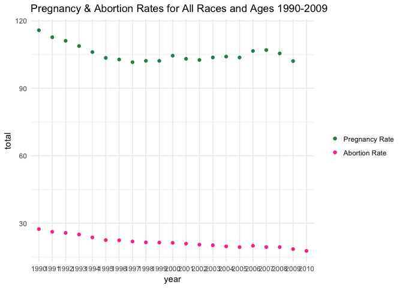

Abortion Rates 1990-2010 Memo
================
Phoebe Abramowitz
3/9/2018

``` r
preg_1990 <- filter(pregnancies_all,year=="1990")$total
abort_1990 <- filter(abortions_all,year=="1990")$total
abortion_rate_1990 <- abort_1990/preg_1990

preg_2009 <- filter(pregnancies_all,year=="2009")$total
abort_2009 <- filter(abortions_all,year=="2009")$total
abortion_rate_2009 <- abort_2009/preg_2009

abortion_rate_1990
```

    ## [1] 0.2366149

``` r
abortion_rate_2009
```

    ## [1] 0.1811949

Pregnancy rates in the United States rose from 1980 to a peak in 1990, and have since been in decline, with the exception of a brief increase in 2006-2007(Curtin 2013: 4). The decline in pregnancy rates is probably the main factor driving the decline in the abortion rate. It appears as though the rate of pregnancies ending in abortion decreased from 23% in 1990 to 18% in 2009(Curtin Data, my analysis). According to the Guttmacher Policy Review, between 2008 and 2011, the proportion of unintended pregnancies ending in abortion did not change (Dreweke 2016: 2), despite the fact that the abortion rate dropped 25% from 2008 to 2014(Jones 2017:1). It's less clear how TRAP laws affect abortion rates in particular areas(Grossman).

Data Visualizations and Analysis
--------------------------------

For all the graphs below, rates are pregnancy outcomes per 1,000 women in specified group, estimated as of April 1 for 1990, 2000, and 2010, July 1 for all other years. All data comes from <https://www.cdc.gov/nchs/data/databriefs/db136_tables.pdf#2>, table \#2 from the Curtin source.
If there's any other age and race breakdowns in particular I should examine, I'm able to easily do so now that I have everything set up.

### Pregnancy Rates by Race, 1990-2009

 \#\#\#Pregnancy Rates and Abortion Rates Comparison  Then, we consider the forces driving the decline in pregnancy rates. Once we have data on these factors separated by age, class, etc, we can weight by percentage contributing to the pregnancy rate. Specifically, the abortion rate decreased 46% for adolescents aged 15-19(Jones 2017:1). Adolescents in this age group had an abortion incidence of 40.3 and abortion rate of 23% once pregnant. That incidence rate was down to 16.3 in 2009, and the abortion rate of adolscents 15-19 was down to 16%(All Curtin Data, my analysis below).

``` r
abortion_incidence_1990 <- filter(abortions_all,year=="1990")$X15.19
abortion_incidence_1990
```

    ## [1] 40.3

``` r
abortion_incidence_2009  <- filter(abortions_all,year=="2009")$X15.19
abortion_incidence_2009
```

    ## [1] 16.3

``` r
ad_preg_1990 <- filter(pregnancies_all,year=="1990")$X15.19
ad_abort_1990 <- filter(abortions_all,year=="1990")$X15.19
ad_abortion_rate_1990 <- abort_1990/preg_1990

ad_preg_2009 <- filter(pregnancies_all,year=="2009")$X15.19
ad_abort_2009 <- filter(abortions_all,year=="2009")$X15.19
ad_abortion_rate_2009 <- abort_2009/preg_2009
ad_abortion_rate_2009
```

    ## [1] 0.1811949

``` r
ad_abort_1990
```

    ## [1] 40.3


Women with incomes less than 100% of the poverty rate had the highest incidence of abortion, and saw an abortion rate decrease relatively consistent with that of the general population(Jones 2017:1). Another factor to consider is permissiveness around premarital sex. There’s generally been a linear upward trend in approval rating of premarital sex since mid-century, but most of that occured in the seventies. 66% of Americans expressed that sex between an unmarried man and woman was acceptable in 2014(Abramowitz memo).

``` r
#Here I want to run multiple regressions to prove what's pushing abortion rates, need to ask for help on coding from a GSI
```

### Bibliography

Jones, Rachel K., and Jenna Jerman. “Abortion Incidence and Service Availability In the United States, 2014.” Perspectives on Sexual Reproductive Health 49, no. 1 (March 2017): 17–27.
Curtin, Sally C., Joyce C. Abma, Stephanie J Ventura, and Stanley K. Henshaw. “Pregnancy Rates for U.S. Women Continue to Drop.” CDC, December 2013.
Grossman D, White K, Hopkins K, and Potter JE. “Change in Distance to Nearest Facility and Abortion in Texas, 2012 to 2014.” JAMA 317, no. 4 (January 24, 2017): 437–39. [https://doi.org/10.1001/jama.2016.17026.\\](https://doi.org/10.1001/jama.2016.17026.\)
Dreweke, Joerg. “New Clarity for the U.S. Abortion Debate: A Steep Drop in Unintended Pregnancy Is Driving Recent Abortion Declines.” Guttmacher Policy Review 19 (2016). [https://www.guttmacher.org/sites/default/files/article\_files/gpr1901916.pdf.\\](https://www.guttmacher.org/sites/default/files/article_files/gpr1901916.pdf.\)
Dreweke, Joerg. “U.S. Abortion Rate Reaches Record Low Amidst Looming Onslaught Against Reproductive Health and Rights.” Guttmacher Policy Review 20 (2017).
